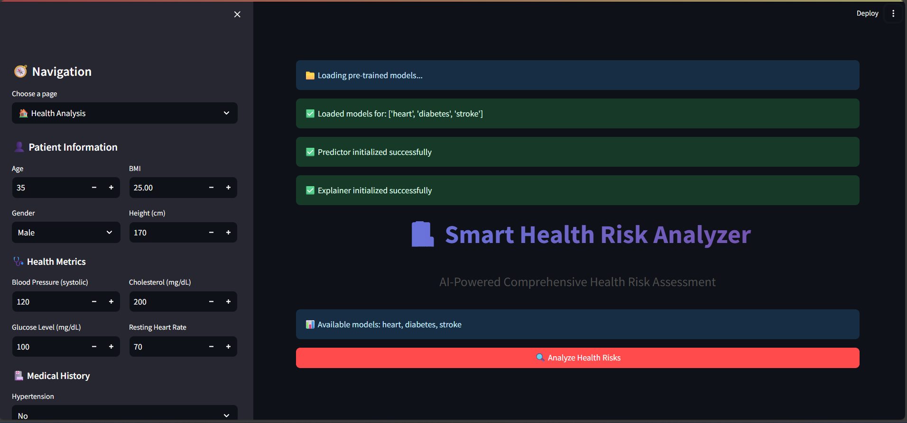
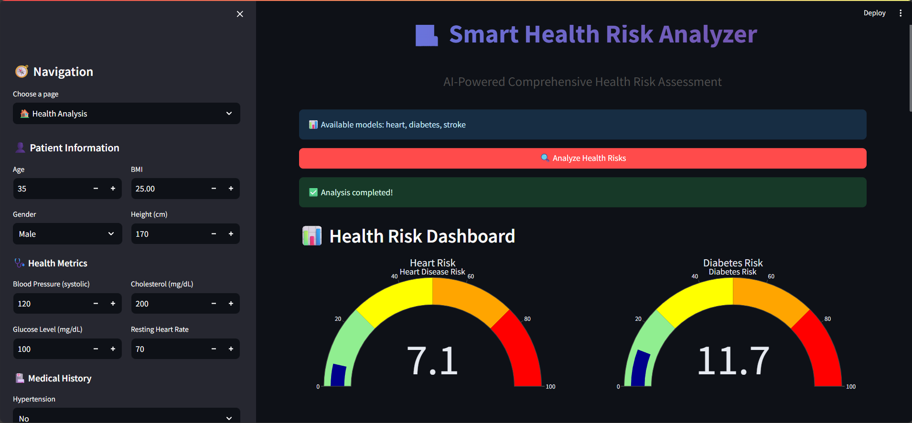
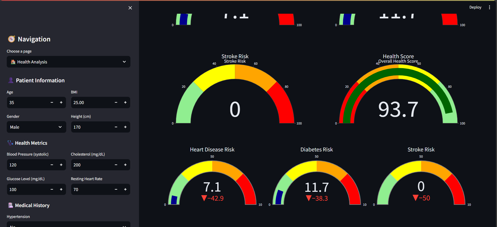
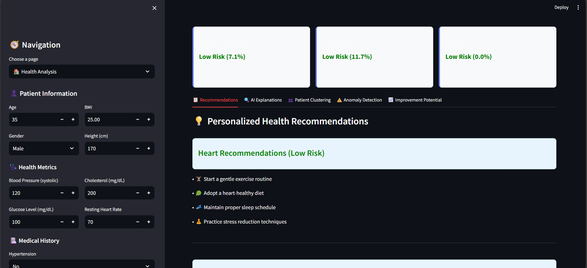
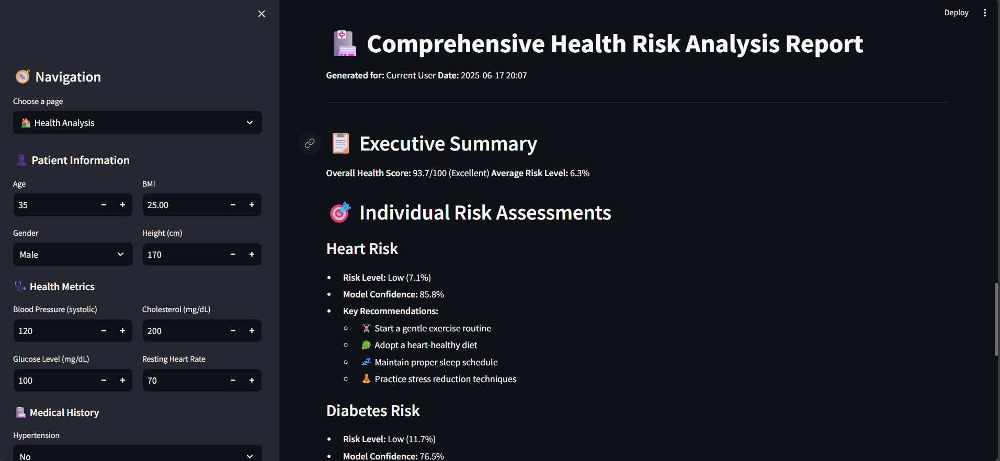
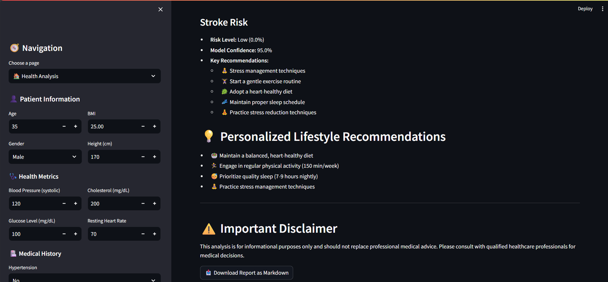
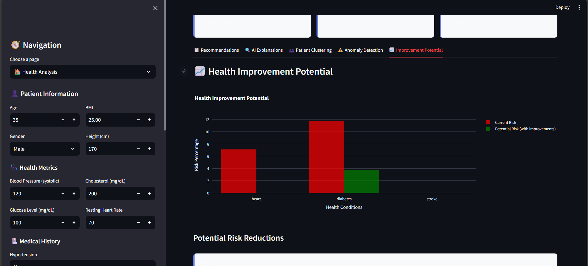

# Smart Health Risk Analyzer

An advanced AI-powered health risk prediction system that combines machine learning, deep learning, and explainable AI to provide comprehensive health risk assessment across multiple diseases.

## Project Overview

The Smart Health Risk Analyzer is an end-to-end machine learning platform that predicts health risks for heart disease, diabetes, and stroke using multiple advanced algorithms. The system features deep neural networks, ensemble methods, model explainability, patient clustering, and anomaly detection with an interactive web-based dashboard.

## Screenshots















## Key Features

**Multi-Disease Risk Prediction**: Simultaneous prediction of heart disease, diabetes, and stroke risks using optimized ML/DL models

**Deep Learning Integration**: Neural networks including Multi-Layer Perceptrons (MLP) and Long Short-Term Memory (LSTM) networks for complex pattern recognition

**Explainable AI**: SHAP and LIME implementations for model interpretability and transparency

**Advanced Analytics**: Patient clustering, anomaly detection, and health improvement potential analysis

**Interactive Dashboard**: Real-time Streamlit web application with dynamic visualizations

**Automated Model Training**: Hyperparameter optimization using Optuna with comprehensive model comparison

## Technology Stack

### Machine Learning & Deep Learning
- **scikit-learn** (1.3.2): Classical ML algorithms (Random Forest, SVM, Logistic Regression, etc.)
- **XGBoost** (2.0.1): Gradient boosting framework
- **LightGBM** (4.1.0): Efficient gradient boosting
- **TensorFlow** (2.15.0): Deep learning framework for MLP and LSTM networks

### Explainable AI & Optimization
- **SHAP** (0.43.0): Model explanation and feature importance analysis
- **LIME** (0.2.0.1): Local interpretable model explanations
- **Optuna** (3.4.0): Bayesian hyperparameter optimization

### Data Science & Visualization
- **pandas** (2.1.3): Data manipulation and analysis
- **numpy** (1.24.3): Numerical computing
- **Streamlit** (1.28.1): Web application framework
- **Plotly** (5.17.0): Interactive visualizations
- **seaborn** (0.13.0): Statistical data visualization

### Specialized Libraries
- **imbalanced-learn** (0.11.0): SMOTE oversampling for class imbalance
- **umap-learn** (0.5.4): Dimensionality reduction for clustering visualization
- **joblib** (1.3.2): Model persistence and efficient serialization

## Project Structure

```
Smart-Health-Risk-Analyzer/
├── data/
│   ├── heart_cleveland_upload.csv
│   ├── diabetes.csv
│   ├── healthcare-dataset-stroke-data.csv
│   └── insurance.csv
├── models/
│   ├── clustering/
│   │   ├── clustering_models.pkl
│   │   ├── dimensionality_reducers.pkl
│   │   ├── anomaly_detectors.pkl
│   │   └── cluster_profiles.pkl
│   ├── [trained_models].pkl/.h5
│   ├── model_scores.pkl
│   └── best_params.pkl
├── app.py                    # Main Streamlit application
├── data_processor.py         # Data preprocessing pipeline
├── model_trainer.py          # ML/DL model training with hyperparameter optimization
├── predictor.py             # Prediction engine with multi-disease support
├── explainer.py             # SHAP/LIME model explanations
├── clustering.py            # Unsupervised learning and anomaly detection
├── utils.py                 # Utility functions and visualizations
├── config.py                # Configuration management
├── train_models.py          # Automated training pipeline
└── requirements.txt         # Dependencies
```

## Deep Learning Architecture

The system implements sophisticated neural network architectures for health risk prediction:

### Multi-Layer Perceptron (MLP)
```python
model = Sequential([
    Dense(128, activation='relu', input_shape=(input_dim,)),
    Dropout(0.3),
    Dense(64, activation='relu'),
    Dropout(0.3),
    Dense(32, activation='relu'),
    Dropout(0.2),
    Dense(16, activation='relu'),
    Dense(1, activation='sigmoid')
])
```

### LSTM Neural Network
```python
lstm_model = Sequential([
    Reshape((sequence_length, features_per_timestep)),
    LSTM(64, return_sequences=True),
    Dropout(0.3),
    LSTM(32),
    Dropout(0.3),
    Dense(16, activation='relu'),
    Dense(1, activation='sigmoid')
])
```

The deep learning models are trained using advanced techniques including early stopping, dropout regularization, and adaptive learning rates to prevent overfitting and ensure robust performance.

## Model Performance

Latest training results demonstrate exceptional performance across multiple diseases:

| Disease | Best Model | Accuracy | Precision | Recall | F1-Score | AUC |
|---------|-----------|----------|-----------|--------|----------|-----|
| Heart Disease | XGBoost | 91.67% | 91.69% | 91.67% | 91.66% | 96.09% |
| Diabetes | LSTM Neural Network | 79.87% | 79.79% | 79.87% | 79.83% | 84.00% |
| Stroke | LightGBM | 94.13% | 92.44% | 94.13% | 93.14% | 77.06% |

### Dataset Statistics
- **Heart Disease**: 256 training samples, 60 test samples, 16 features
- **Diabetes**: 800 training samples, 154 test samples, 11 features  
- **Stroke**: 7,778 training samples, 1,022 test samples, 13 features
- **Insurance**: 1,070 training samples, 268 test samples, 9 features

## Advanced Features

### Explainable AI Integration
The system provides comprehensive model explanations using both SHAP (global and local feature importance) and LIME (local interpretable explanations) to ensure transparency and trust in AI predictions.

### Patient Clustering & Profiling
Unsupervised learning algorithms (K-Means, Gaussian Mixture Models, DBSCAN) segment patients into risk profiles with detailed cluster characteristics and health risk assessments.

### Anomaly Detection
Isolation Forest and Local Outlier Factor algorithms identify unusual health patterns that may require immediate medical attention.

### Hyperparameter Optimization
Optuna framework automatically tunes model parameters using Bayesian optimization to achieve optimal performance across all algorithms.

## Installation & Usage

### Prerequisites
- Python 3.8+
- 8GB RAM recommended

### Setup
1. Clone the repository
2. Install dependencies: `pip install -r requirements.txt`
3. Place datasets in `data/` directory
4. Train models: `python train_models.py`
5. Launch application: `streamlit run app.py`
6. Access dashboard at `http://localhost:8501`

## Application Interface

The Streamlit dashboard provides an intuitive interface for health risk assessment with real-time predictions, interactive visualizations, and comprehensive health reports. Users can input health metrics and receive immediate risk assessments with detailed explanations and personalized recommendations.

## Technical Innovation

This project demonstrates advanced implementation of ensemble learning, deep neural networks, explainable AI, and real-time web applications. The combination of classical machine learning with modern deep learning approaches, enhanced by comprehensive model explainability, represents a state-of-the-art approach to healthcare risk prediction.

## Developer

**Vaibhav Sharma**  
AI/ML Engineer & Data Scientist

- Email: itsvaibhavsharma007@gmail.com
- GitHub: [@itsvaibhavsharma](https://github.com/itsvaibhavsharma)
- LinkedIn: [@itsvaibhavsharma](https://linkedin.com/in/itsvaibhavsharma)

## License

MIT License - see LICENSE file for details.

## Medical Disclaimer

This application is for educational and research purposes only. All predictions should be verified by qualified healthcare professionals and do not replace professional medical advice.